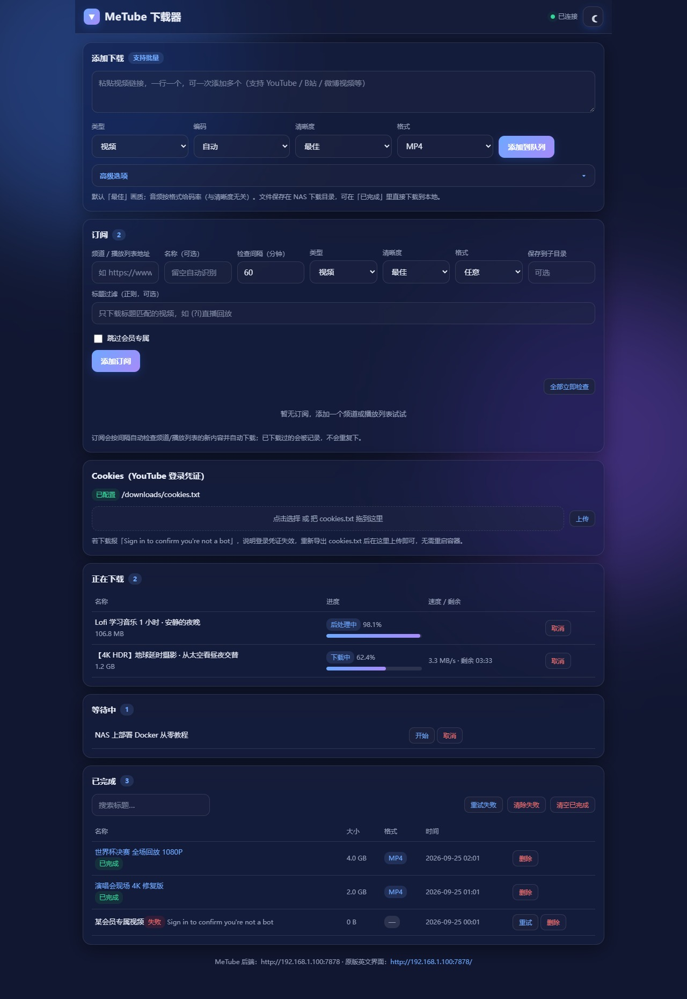
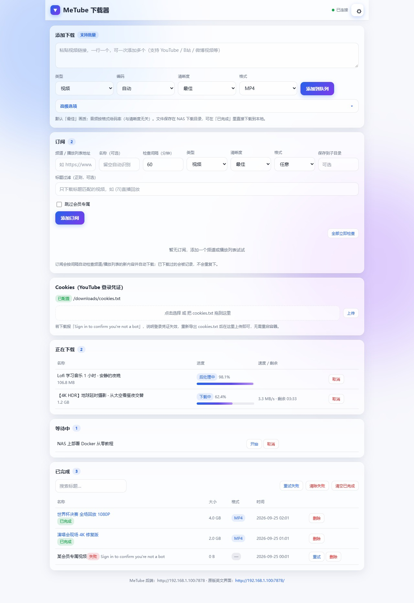
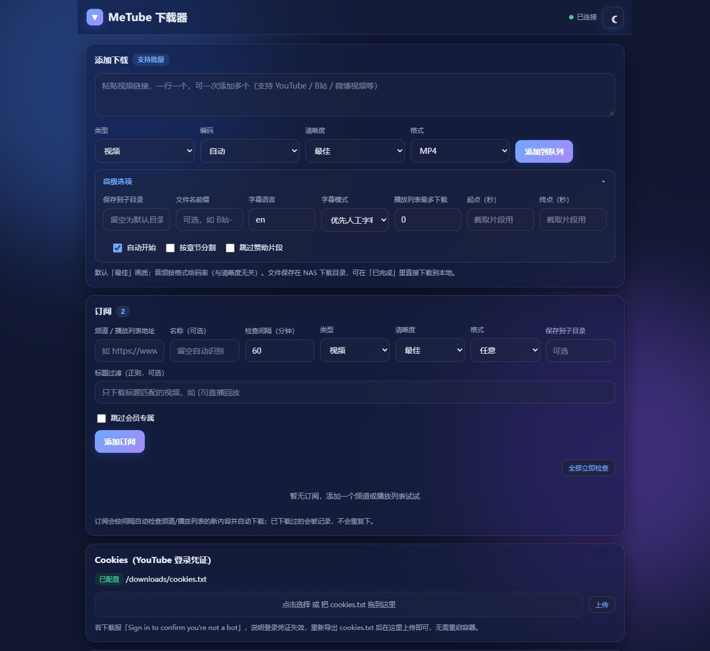
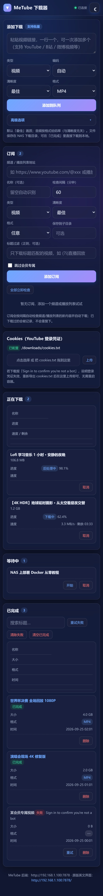

本项目纯AI生成，目的仅自用，如使用不当本人概不负责。

# MeTube 中文前端（metube-cn）

给 [MeTube](https://github.com/alexta69/metube)（alexta69/metube）套一层中文操作界面。
MeTube 官方没有多语言支持（只有明暗主题），本项目通过它的 HTTP API 与 socket.io 实时接口，另做一个纯前端页面，部署在 nginx 容器里，与 MeTube 并存、互不干扰。

## 界面预览

| 桌面端 · 深色 | 桌面端 · 浅色 |
|---|---|
|  |  |

| 高级选项 | 移动端 |
|---|---|
|  |  |

## 界面特性

- **全中文**：添加下载、Cookies、订阅、队列、已完成，全部中文化
- **默认 MP4**：视频格式默认 MP4，后端再以 `merge_output_format` 兜底——即使源流是 WebM/MKV 等其他容器，下载完也会自动 remux 成 MP4（不重编码，几乎不耗时）
- **玻璃拟态 + 暗黑主题**：右上角按钮切换，选择记在浏览器本地，首次跟随系统深浅色偏好
- **移动端适配**：≤720px 时表格自动转卡片，输入框 16px 防 iOS 缩放，按钮全宽
- **实时进度**：socket.io 推送，进度条 + 百分比 + 速度 + 剩余时间，完成后自动移到「已完成」
- **已完成显示格式**：列表直接标出每个文件的实际格式（MP4 / M4A / MP3…），一眼看清下了什么
- **批量添加**：一次粘贴多行链接
- **Cookies 上传**：页面上直接上传 / 拖拽 cookies.txt，凭证失效时不必再进服务器找目录
- **订阅**：频道或播放列表订阅，支持检查间隔、标题正则过滤、跳过会员专属、暂停/启用/立即检查
- **高级选项**：类型（视频/音频/字幕/封面）、编码（H.264/H.265/AV1/VP9）、子目录、文件名前缀、字幕语言与模式、播放列表条数、片段起止、按章节分割、SponsorBlock

板块顺序：**添加下载 → 订阅 → Cookies → 正在下载 → 等待中 → 已完成**

## 快速开始

前置条件：已有一个能用的 MeTube（默认 `7878` 端口）。

### 方式一：docker compose

```bash
docker compose up -d --build
```

打开 <http://你的主机IP:7879/>

### 方式二：docker run

```bash
docker build -t metube-cn:latest .
docker run -d --name metube-cn --restart unless-stopped \
  -p 7879:80 \
  -v "$PWD/index.html:/usr/share/nginx/html/index.html:ro" \
  metube-cn:latest
```

## 必做的一步：给 MeTube 放行跨域

前端在 7879、后端在 7878，属于跨源，必须让 MeTube 允许，否则页面会白屏或连不上实时接口。

在 MeTube 的 compose 里加环境变量（地址换成你的实际地址）：

```yaml
environment:
  - CORS_ALLOWED_ORIGINS=http://192.168.1.100:7879
```

然后重建 MeTube 容器。可用下面的命令验证响应头：

```bash
curl -I -H "Origin: http://192.168.1.100:7879" http://192.168.1.100:7878/history | grep -i access-control
```

## 后端地址怎么定

页面按以下优先级确定 MeTube 地址，一般不用手动配：

1. URL 参数 `?api=http://192.168.1.100:7878`（会记入 localStorage）
2. localStorage 里存过的值
3. 自动推断：当前站点端口是 `7879` 就用同主机的 `7878`，否则同源

页脚会显示当前实际连的后端地址。

## 目录结构

```
.
├── index.html          # 前端页面（全部逻辑都在这里，改完刷新即生效）
├── socket.io.min.js    # socket.io 4.7.5 客户端（本地内置，不依赖 CDN）
├── Dockerfile
├── nginx.conf          # gzip + 不缓存
├── docker-compose.yml
├── docs/screenshots/   # README 界面截图
└── README.md
```

## 日常维护

- **改界面**：覆盖 `index.html` 即可（挂载方式下无需重启容器；纯镜像方式需 `docker build` 重建）
- **换端口**：改 compose 里的 `7879:80` 左侧端口
- **cookie 失效**：YouTube 会轮换登录态，页面报「Sign in to confirm you're not a bot」时，在页面 Cookies 区重新上传即可

## 与 MeTube 的接口约定（开发参考）

| 用途 | 接口 |
|---|---|
| 队列/已完成 | `GET /history` |
| 添加下载 | `POST /add`（JSON） |
| 删除 / 重试 | `POST /delete`、`POST /start` |
| 订阅 | `POST /subscribe`、`GET /subscriptions`、`POST /subscriptions/update\|delete\|check` |
| Cookies | `GET /cookie-status`、`POST /upload-cookies`（multipart，字段名 `cookies`） |
| 实时事件 | socket.io：`all` / `added` / `updated` / `completed` / `canceled` / `cleared` / `custom_dirs` / `subscriptions_all` 等 |

两个容易踩的坑：

1. 事件载荷是 **JSON 字符串**，需要先 `JSON.parse`（页面里已处理）
2. `all` 事件结构是 `[未完成项, 已完成项]` 的元组，每项形如 `[id, info]`
3. `custom_dirs` 事件是**对象**（按下载目录分组），不是数组

## License

MIT
