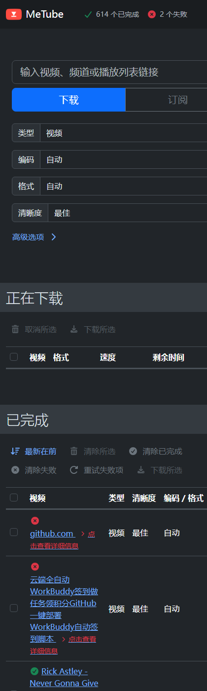

本项目纯AI生成，目的仅自用，如使用不当造成损失本人概不负责。

# MeTube 中文界面（原版汉化）

> **重要变更**：本项目已改为**对 MeTube 原版前端做汉化**。
> 此前 v1 是另写的一套玻璃拟态界面（独立单页 + 跨域调用），现已整包删除；
> 实测用着不顺手，也要自己维护两套逻辑，不如直接汉化原版来得稳，故不再保留。

做法是：把 [MeTube](https://github.com/alexta69/metube) 官方 Angular 前端的编译产物取出来，**只替换界面文案**，
页面结构、按钮位置、下拉顺序、折叠区块一律不动，再用 nginx 托管并同源反代后端接口。
功能与原版完全一致，只是语言变成中文。


窄屏（手机）下布局自适应，与原版一致：



## 与原版的关系

| | 原版 7878 | 本项目 7879 |
|---|---|---|
| 界面结构 | MeTube 官方 | **完全一致** |
| 界面语言 | 英文 | 中文 |
| 可用功能 | 全部 | **全部**（同一套后端接口） |
| 后端 | 同左 | 反代到同一个 MeTube 容器 |

## 快速开始

前置条件：一个已在运行的 MeTube（默认 `http://<host>:7878/`）。

### 方式一：docker compose

```bash
docker compose up -d --build
```

打开 <http://你的主机IP:7879/>

`METUBE_BACKEND` 是 nginx 反代的目标，两种常见取值：

- **同一 docker 网络**（推荐）：`metube:8081`，并把本容器加入 MeTube 所在网络（见 compose 里的 `networks`）
- **走宿主机端口**：`host.docker.internal:7878`（Linux 需加 `extra_hosts: ["host.docker.internal:host-gateway"]`）

### 方式二：docker build + run

```bash
docker build -t metube-cn:latest --build-arg METUBE_BACKEND=metube:8081 .
docker run -d --name metube-cn --restart unless-stopped -p 7879:80 \
  --network <metube所在网络> metube-cn:latest
```

### 方式三：直接用官方 nginx 镜像挂载（调试界面最快）

```bash
docker run -d --name metube-cn --restart unless-stopped -p 7879:80 \
  --network <metube所在网络> \
  -v $PWD/dist:/usr/share/nginx/html:ro \
  -v $PWD/nginx.conf:/etc/nginx/conf.d/default.conf:ro \
  nginx:alpine
```

> 这种模式下 `nginx.conf` 里的 `__BACKEND__` 需要自己替换成实际后端地址；上面的 Dockerfile 是构建时自动替换。

## 目录结构

```
dist/                汉化后的原版前端编译产物（index.html / main-*.js / styles-*.css …）
nginx.conf           nginx 站点配置，__BACKEND__ 为反代目标占位符
Dockerfile           基于 nginx:alpine，构建时替换占位符并拷贝 dist
docker-compose.yml   编排示例
tools/
  fetch-original.sh  从运行中的 MeTube 抓取原版前端资源
  metube_zh.py       汉化脚本（MeTube 升级后可重新生成）
docs/screenshots/    界面截图
```

## MeTube 升级后如何重新汉化

MeTube 每次升级，前端 bundle 文件名里的 hash 都会变（`main-<hash>.js`），原有的汉化产物随之失效。重跑一次即可：

```bash
# 1. 抓取当时的原版前端到 ./dist-orig
./tools/fetch-original.sh http://<host>:7878 ./dist-orig

# 2. 汉化，输出到 ./dist
python3 tools/metube_zh.py ./dist-orig --out ./dist

# 3. 语法必须通过，否则页面直接白屏
node --input-type=module --check < dist/main-*.js

# 4. 重建容器
docker compose up -d --build
```

脚本会打印「未命中」的条目——那通常意味着新版本改了文案，人工补进 `metube_zh.py` 的规则表再跑一次。

## 汉化是怎么做的

不重新构建 Angular 项目，只对编译产物做**限定语法位置**的字符串替换：

| mode | 匹配位置 | 例子 |
|---|---|---|
| `text` | `ɵɵtext(N,"X")` 文本节点 | 表头、标签 |
| `attr` | `placeholder / title / aria-label / alt` | 输入框提示 |
| `opt` | `text:"X"` 下拉选项 | Best / Worst |
| `disp` | `displayName:"X"` | 主题名 |
| `cfg` | `xxxText="X"` | ng-select 内置文案 |
| `ve` | 插值调用内部 | 「N 个正在下载」 |
| `lang` | 字幕语言数组内 | Chinese (Simplified) |

**踩过的坑**：`Format` / `URL` / `Active` / `Default` / `None` / `Delete` 这些词在 Angular 内部枚举、键盘事件名、Sanitizer 里也有同名出现，
全局替换会直接把程序改坏，所以这些必须用受限 mode。

另一处隐性坑：表格里「类型 / 清晰度 / 编码」三列的文字**不在模板里**，而是运行时用 `charAt(0).toUpperCase()` 现场拼出来的
（`"video"` → `"Video"`），只能改这三个函数的实现，见 `metube_zh.py` 里的 `PATCHES`。

保留英文的部分：MP4、SRT、AV1、kbps、MeTube、GitHub 等专有名词与技术标识。

## 许可证

**AGPL-3.0**。本项目是 MeTube 的衍生作品，上游 MeTube 采用 AGPL-3.0，全文见 [LICENSE](LICENSE)。

- 上游来源：<https://github.com/alexta69/metube>（AGPL-3.0）
- 本仓库的改动：界面文案汉化规则（`tools/metube_zh.py`）与 nginx 部署配置
- `dist/` 为汉化后的编译产物，其对应源码可在上游仓库获取，汉化改动可由上述脚本复现
